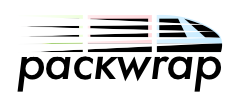

___
Packwrap is a framework to build modular surveys based on React components and a declarative survey format. The framework provides state management, simple integration with a REST api backend and simulated data responses.

## Pack components
Pack components are the building blocks of a packwrap app. Each component returns response data that advances the survey to the next screen, or survey "module", using the `push` function exposed from packwrap.

Here is a simplified example of pack component that asks for a binary response, 'A' or 'B' using radio buttons:
```javascript
({ name='qux', options=['A', 'B'], push }) => (
  <div>
  {
    options.map((option, i) => (
      <label
        key={i}
        onClick={() => push({ [name]: option })}
      >
        {option}
        <input type="radio" />
      </label>
    ))
  }
  </div>
)
```

## Survey modules
We can use pack components for our survey "modules" — specific instantiations of our components that we define using a special JSON format which passes parameters as props to our components. For example we could define the following module, using a component named "Radio", that polls respondents on Donald Trump and Hillary Clinton:
```JSON
{
  "component": "Radio",
  "text": "Who's better?",
  "options": [
    "Hillary Clinton",
    "Donald Trump"
  ]
}
```  

## Survey state
Packwrap maintains a single atomic state for a survey application, including survey response data, variables and an index that determines which survey module to display. Components can update the state using the `push` function which increments the index and loads the next module. Each module can read from the survey state using a special `$` syntax.

## Wrapper component
A wrapper component is a special container component to style and house a survey. It can access the survey state and display a progress bar or other useful information.

## `pack`
The pack function is a higher-order function that takes in a pack of components and returns a special function to run different surveys use the same component pack. Putting it all together, here is how we might define and run a simple election survey:
```javascript
import { pack } from 'packwrap'
import components from 'my-components'
import wrapper from 'my-wrapper'

const run = pack(components)

const initialState = {
  start: Date.now()
}

const modules = [
  {
    "component": "Markdown",
    "source": "### Instructions\nPlease be honest"
  },
  {
    "component": "Radio",
    "name": "candidate",
    "text": "Who's better?",
    "options": [
      "Hillary Clinton",
      "Donald Trump"
    ]
  },
  {
    "component": "Radio",
    "name": "bernie",
    "text": "You prefer ${candidate}?? What about Bernie?",
    "options": [
      "Love him",
      "Don't like him"
    ]
  }
]

const elementId = 'root' // id of div to mount app

run(initialState, modules, elementId, wrapper)
```
